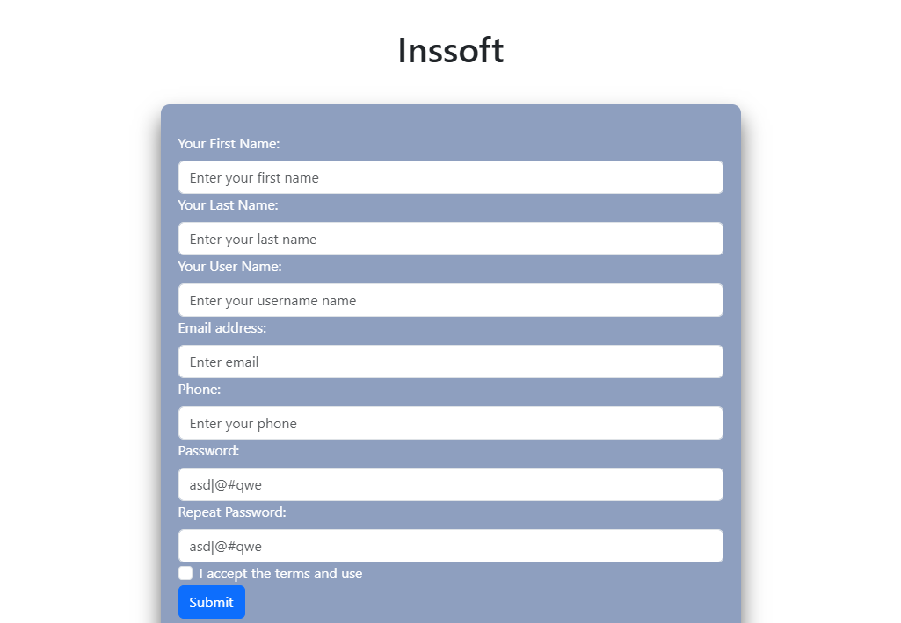

## Inssoft Tecnical Test

## Description

Prueba para Full stack developer

Frontend
La prueba consiste en construir una app web con Vue. Deberá de contener un formulario
de
registro de usuario (con los datos convencionales) y enviarlo a través de un consumo de
un
endpoint de la API creada anteriormente. Necesitarás usar VUE , NUXT, Bootstrap Vue,
Typescript.

Backend
La prueba consiste en construir una API con NestJs con un endpoint POST para agregar
el
usuario del registro de la app del frontend a la base de datos. Deberá utilizar NestJs,
typeorm, Postgres.

Los códigos deberán ser subidos a su cuenta de GitHub y proporcionar el link cuando se
termine.
Nota: Se evaluará el nivel de código que se implemente en el proyecto.

## Tech Stack

    - NestJs
    - Postgres
    - Vue3
    - Bootstrap Vue Next
    - Typescript
    - Nuxt
    - TypeORM

## Deployed App

- **URL de la Aplicación Desplegada:** [https://kiferlabs.store](https://kiferlabs.store)

## Inssoft Tecnical Test

